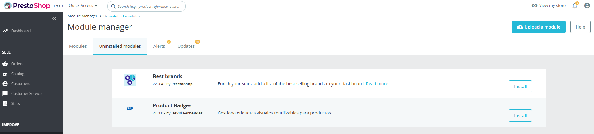
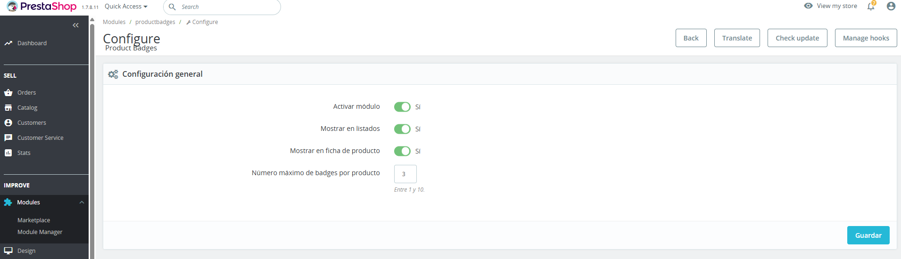
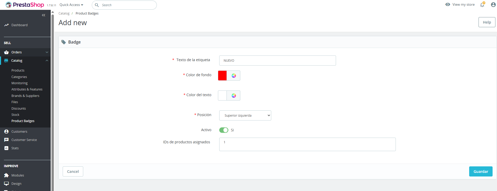
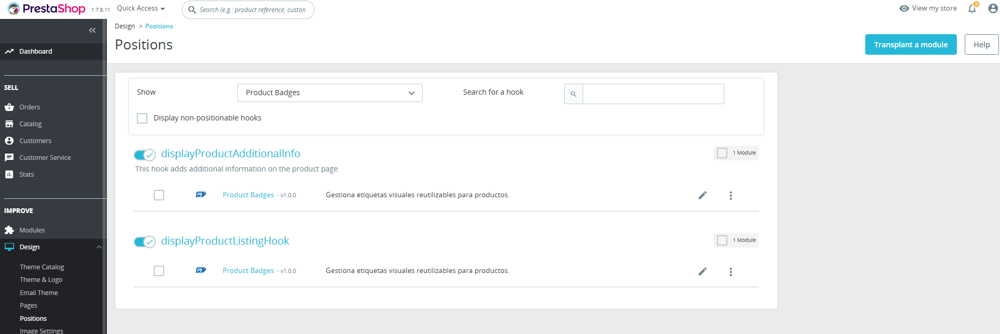

# Product Badges para PrestaShop 1.7

Módulo para PrestaShop 1.7 que permite crear y gestionar etiquetas visuales
reutilizables para productos, como "NUEVO", "OFERTA", "EXCLUSIVO" o "ÚLTIMAS UNIDADES".

## Requisitos

- PrestaShop 1.7.8.x
- Probado en PrestaShop 1.7.8.11 usando Docker
- MariaDB 10.6
- PHP incluido en la imagen oficial de PrestaShop 1.7.8.11
- MySQL o MariaDB compatible con PrestaShop
- Sin dependencias externas de Composer
- Sin librerías JavaScript externas más allá de jQuery, ya incluido por PrestaShop

## Instalación

1. Copia la carpeta `modules/productbadges` dentro del directorio `modules/` de tu instalación de PrestaShop.
2. Ve al back office → **Módulos → Gestor de módulos**.
3. Busca "Product Badges" e instálalo.

Durante la instalación el módulo crea automáticamente las tablas necesarias,
registra los hooks y añade la entrada de menú en **Catálogo → Product Badges**.

En la prueba local con Docker se copió el módulo al contenedor con:

```bash
docker cp "C:\ruta\a\tu\proyecto\modules\productbadges" prestashop:/var/www/html/modules/
```

## Desinstalación

Desde el gestor de módulos, desinstala el módulo. Se eliminarán:

- Las 4 tablas del módulo (`productbadges`, `productbadges_lang`, `productbadges_product`, `productbadges_shop`)
- Los hooks registrados
- La pestaña del back office
- Los valores de configuración guardados

## Uso

### Crear una badge

1. Ve a **Catálogo → Product Badges → Añadir nueva badge**.
2. Rellena el texto en los idiomas activos si procede, color de fondo, color del texto y posición.
3. En el campo "IDs de productos asignados" escribe los IDs de los productos separados por comas. Ejemplo: `1,5,23`.
4. Guarda.

### Configuración global

Desde **Módulos → Product Badges → Configurar** puedes:

- Activar o desactivar el módulo globalmente
- Mostrar o no badges en listados de categoría
- Mostrar o no badges en la ficha de producto
- Definir el número máximo de badges visibles por producto, entre 1 y 10

## Pruebas realizadas

El módulo se ha probado en un entorno local con Docker usando:

- PrestaShop 1.7.8.11
- MariaDB 10.6
- Imagen oficial `prestashop/prestashop:1.7.8.11`

Durante la prueba se verificó correctamente:

- PrestaShop se instaló correctamente en Docker.
- El módulo apareció en el gestor de módulos.
- El módulo se instaló correctamente desde el back office.
- La pantalla de configuración global funcionó correctamente.
- La pestaña **Catálogo → Product Badges** se registró correctamente.
- El formulario de creación de badges se mostró correctamente.
- Se pudo crear una badge de prueba con texto, colores, posición, estado activo e IDs de producto.
- Los hooks `displayProductAdditionalInfo` y `displayProductListingHook` aparecieron registrados en **Diseño → Posiciones**.

### Capturas de prueba

#### Módulo disponible en el gestor de módulos



#### Pantalla de configuración del módulo



#### Creación de una badge desde el back office



#### Hooks registrados



### Nota sobre frontend

La instalación, configuración, registro de hooks y gestión desde back office funcionaron correctamente.

Durante la prueba frontend se comprobó que la visualización en listados depende del hook ejecutado por el tema activo. El módulo registra `displayProductListingHook`, pero en el tema Classic de PrestaShop 1.7.8.11 puede requerirse adaptar la plantilla del tema o usar un hook alternativo para pintar la badge exactamente encima de cada producto del listado.

Esta limitación queda documentada porque el enunciado indica que algunos contextos de listado, búsqueda y home dependen de si el tema activo los soporta.

## Decisiones técnicas

### ObjectModel con multilenguaje y multitienda

Se usa el `ObjectModel` de PrestaShop con `multilang: true` y `multishop: true`.

Las tablas `_lang` y `_shop` se crean explícitamente en el script SQL de instalación. El `ObjectModel` queda preparado para trabajar con ellas siguiendo las convenciones de PrestaShop.

Esto permite guardar el texto traducible de cada badge y mantener una estructura coherente con el contexto multitienda.

### Separación back office / módulo principal

Toda la lógica del back office, listado, formulario CRUD y validaciones está en
`AdminProductBadgesController`, extendiendo `ModuleAdminController`.

El archivo principal `productbadges.php` contiene:

- Instalación
- Desinstalación
- Registro de hooks
- Página de configuración global
- Hooks frontend

Esta separación evita concentrar toda la lógica en el archivo principal del módulo.

### Sanitización y validación

- IDs siempre casteados con `(int)` antes de usarlos en SQL.
- Colores validados con regex `/^#[0-9a-fA-F]{6}$/` tanto en el controller como en la definición del `ObjectModel` (`validate: isColor`).
- Posición validada contra la constante `VALID_POSITIONS = ['top-left', 'top-right']`.
- Textos escapados con `Tools::safeOutput()` en callbacks del listado.
- Textos limitados a 60 caracteres.
- `LIMIT` en SQL siempre con valor entero sanitizado y con clamp entre 1 y 10.
- Escapado de variables en la plantilla Smarty.
- Validación server-side además de los controles visuales del formulario.

### Carga eficiente de assets

CSS y JS solo se cargan en los controladores frontend donde pueden aparecer badges:

- `category`
- `product`
- `search`
- `index`

Se usa `addCSS()` y `addJS()` del contexto del controlador, no etiquetas `<link>` o `<script>` a mano.

### Multilenguaje

El texto de cada badge se guarda en la tabla `productbadges_lang`.

Se han preparado archivos de traducción para:

- Español: `translations/es.php`
- Inglés: `translations/en.php`

Las claves reales de traducción legacy pueden regenerarse desde el back office de PrestaShop en **Internacional → Traducciones**.

### Multitienda

Las badges se filtran por `id_shop` en la tabla `productbadges_shop`.

El módulo no rompe en instalaciones multitienda y usa el `id_shop` del contexto activo en frontend.

No se ha implementado una interfaz avanzada para gestionar badges distintas por tienda, porque queda fuera del alcance de este ejercicio, pero la arquitectura lo permite añadiendo lógica sobre la tabla `_shop`.

## Estructura del proyecto

```text
├── README.md
├── IA.md
├── modules/
│   └── productbadges/
│       ├── productbadges.php
│       ├── config.xml
│       ├── logo.png
│       ├── classes/
│       │   └── ProductBadge.php
│       ├── sql/
│       │   ├── install.php
│       │   └── uninstall.php
│       ├── controllers/
│       │   └── admin/
│       │       └── AdminProductBadgesController.php
│       ├── views/
│       │   ├── templates/
│       │   │   └── hook/
│       │   │       └── product-badges.tpl
│       │   ├── css/
│       │   │   └── productbadges.css
│       │   └── js/
│       │       └── productbadges.js
│       └── translations/
│           ├── es.php
│           └── en.php
├── docs/
│   └── screenshots/
│       ├── module-admin.png
│       ├── module-admin2.png
│       ├── create-productbadge.png
│       └── manage-hooks.png
└── .gitignore
```

## Qué se ha dejado fuera

- **Selector visual de productos**: el campo de IDs de producto es un textarea de texto libre por limitación de tiempo. En producción se integraría con el autocomplete de productos de PrestaShop.
- **Tests unitarios**: no se han implementado.
- **Gestión diferenciada por tienda**: la estructura multitienda está preparada, pero no se ha añadido una interfaz avanzada para elegir tiendas manualmente por badge.
- **Adaptación específica de plantilla para todos los temas**: el hook `displayProductListingHook` queda registrado, pero algunos temas pueden requerir adaptar la plantilla o usar un hook alternativo.
- **Orden visual avanzado de badges**: se muestran ordenadas por ID.

## Asunciones tomadas

- Se asume tema Classic de PrestaShop 1.7 como referencia para la prueba.
- Se asume que el administrador conoce los IDs de producto, ya que no se ha implementado autocomplete.
- El campo `position` admite solo `top-left` y `top-right`.
- El posicionamiento real se controla vía CSS en la plantilla.
- La visualización en listados depende de los hooks que ejecute el tema activo.
- El módulo prioriza instalación limpia, estructura clara, validación server-side y uso de APIs nativas de PrestaShop.

## Uso de IA

El uso de IA durante el desarrollo está documentado en `IA.md`, incluyendo herramientas utilizadas, prompts relevantes, errores detectados en el output de la IA y partes realizadas manualmente.

## Autor

David Fernández